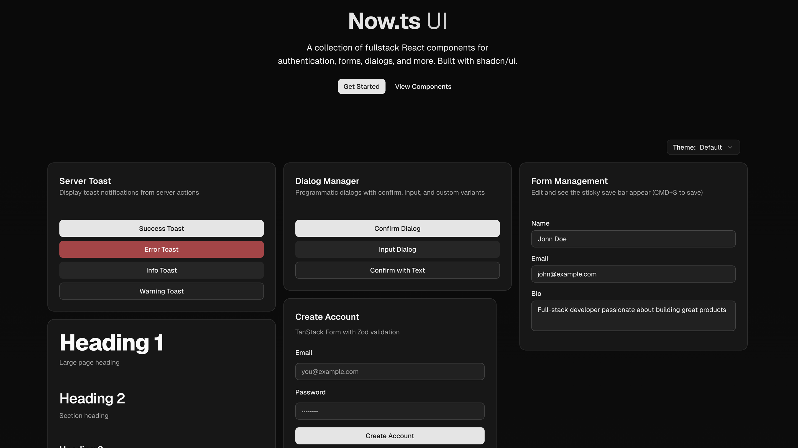

# Now.ts UI

[Now.ts UI](https://ui.nowts.app) is a collection of fullstack React components for authentication, forms, dialogs, and more. Built with [shadcn/ui](https://ui.shadcn.com/).

## Overview

Now.ts UI provides pre-built, customizable React components designed for modern fullstack applications. From authentication forms to dialog management, form handling with TanStack Form, and more—all built on top of shadcn/ui with TypeScript and modern best practices.

## Installation

You can use the shadcn CLI to add components to your Next.js project:

```bash
# Install all components
npx shadcn@latest add https://ui.nowts.app/r/all.json

# Install a specific component
npx shadcn@latest add https://ui.nowts.app/r/tanstack-form.json
```

## Prerequisites

Before using Now.ts UI, ensure your Next.js project meets these requirements:
- **Node.js 18** or later
- **shadcn/ui** initialized in your project (`npx shadcn@latest init`)
- **Tailwind CSS** configured

## Usage

### Install All Components

Install all available Now.ts UI components at once:

```bash
npx shadcn@latest add https://ui.nowts.app/r/all.json
```

This command will:
- Install all Now.ts UI components to your configured components directory
- Add necessary dependencies to your project

### Install Specific Components

Install individual components using the shadcn CLI:

```bash
npx shadcn@latest add https://ui.nowts.app/r/<component-name>.json
```

Examples:

```bash
# Install the TanStack Form component
npx shadcn@latest add https://ui.nowts.app/r/tanstack-form.json

# Install the Dialog Manager component
npx shadcn@latest add https://ui.nowts.app/r/dialog-manager.json

# Install the Server Toast component
npx shadcn@latest add https://ui.nowts.app/r/server-toast.json
```

All available components can be found at [ui.nowts.app/docs/components](https://ui.nowts.app/docs/components).

## Featured Components

- **TanStack Form** - Type-safe form handling with Zod validation
- **Dialog Manager** - Programmatic dialog management with confirm, input, and custom variants
- **Server Toast** - Display toast notifications from server actions
- **Extended Form** - Enhanced form components with Better Auth integration
- **Field Components** - Accessible form field primitives for complex layouts

## About NOW.TS

NOW.TS is a Next.js 15 boilerplate that helps you build and launch SaaS applications faster. Learn more at [nowts.app](https://nowts.app).

## Contributing

If you'd like to contribute to Now.ts UI, please follow these steps:

1. Fork the repository
2. Create a new branch
3. Make your changes to the components in the registry
4. Open a PR to the main branch

Please read the [contributing guide](/CONTRIBUTING.md).

## License

Licensed under the [MIT license](https://github.com/melvynx/nowts-ui/blob/main/LICENSE.md).

Built by [Melvyn](https://twitter.com/melvynxdev).
